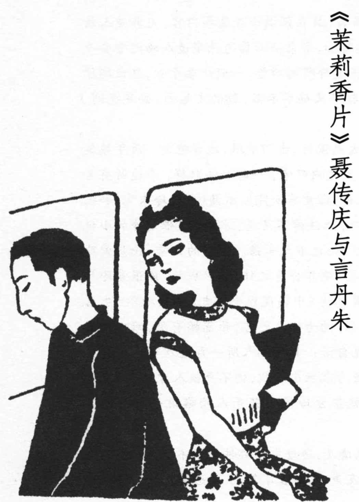

#聂传庆，一款扭曲的精神恋父癖

> “他对于丹朱的憎恨，正像他对于言子夜的畸形的倾慕，与日俱增。”
>
> ——张爱玲《茉莉香片》

**一个暴论：聂传庆是一款扭曲的精神恋父癖。**

---

他早已死去的母亲，成了他身上的一部分——传庆像是母亲的遗物，在延续了母亲遗憾的恋情时，也继承了母亲哀怨的人生。他们爱着同一个男人，一个想当他妻子，一个想当他孩子。

母亲没能选择言子夜作为他的父亲，早早死去了，父亲没能给他应有的爱与尊重，日复一日打压他。所以传庆将所有的恨意都倾泻给了言子夜的孩子，丹朱。他羡慕丹朱，因为丹朱是言子夜的孩子，他妒忌丹朱，因为他无法成为丹朱。

传庆爱着丹朱所代表的位置，爱着丹朱背后那个被称为“父亲”的男人。当然，这并不代表传庆是真的同性恋，他只是爱那个在他脑中被过度美化的“父亲”这一精神概念，日日夜夜的幻想母亲当年如若选择言子夜，他成为丹朱的美满人生。说到底他只是希望有个正常的家庭让他过上正常的人生，但可怜之人必有可恨之处。

---

> “丹朱，如果你同别人相爱着，对于他，你不过是一个爱人。可是对于我，你不单是一个爱人，你是一个创造者，一个父亲，母亲，一个新的环境，新的天地。你是过去与未来。你是神。”

传庆无法成为言子夜的孩子，这在丹朱出生、他也出生时就已经注定。所以他希望丹朱爱他，哪怕只有一点爱——这是他新父母诞生的最后可能性。所以聂传庆分明恨丹朱恨到想用名为爱的缰绳奴役她，下一秒却又变成了祈求爱的卑微者。

但丹朱不爱他，所以他殴打了丹朱，把她丢在了阴冷的荒山。可丹朱没有死，他的人生也永远无法逃离丹朱。

---

其实传庆需要的并不是新的父亲、新的母亲或者新的开始，而是本该在他出生之时，就倾注于他身上的爱、尊重与自由。伪善的丹朱和幻想的言子夜都无法救赎他，他注定在母亲的哀怨中，随屏风上的鸟一起霉了、给虫蛀了，死也死在屏风上。